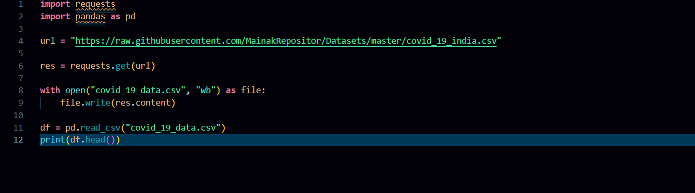
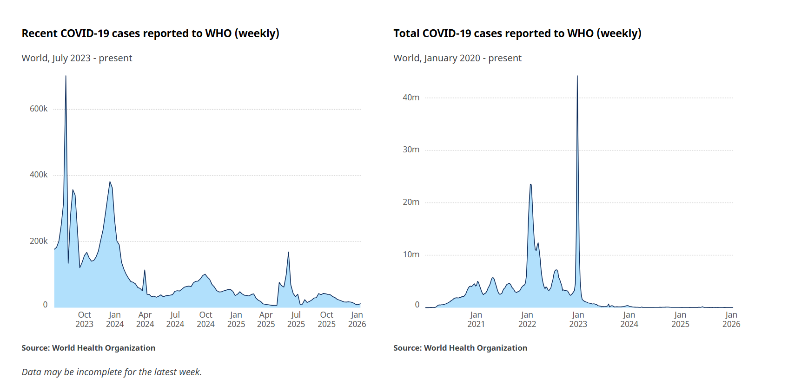

# VAUTECH IT SOLUTIONS – TASK 1

**Intern:** Priyanshu Thakur  

**Intern ID:** VT26DS006

**Domain:** Data Science

**Company:** VAUTECH IT SOLUTIONS 

**Mentor:** Vishal Rajbhar 

---

## Task: Understanding Suicide data for Mental Health Analysis

For this task, I worked with a real-world COVID-19 dataset containing information about confirmed cases, deaths, recoveries, and testing data from many countries across different years. The main objective of this task was to understand what the dataset represents and what kind of real-life problems it can help us study.
The dataset contains information such as country/region, date, total confirmed cases, total deaths, total recovered cases, active cases, and other relevant indicators..

**Dataset Source:**
https://raw.githubusercontent.com/MainakRepositor/Datasets/master/covid_19_india.csv

## Why i chose this dataset

I chose this dataset because COVID-19 had a major impact on global health and economies. Analyzing this type of data can help us understand how the virus spread, which countries were most affected, and how effective different control measures were. It also supports decision-making for public health planning and awareness

## What this data can help us find

Using this dataset, we can try to answer questions such as:

- Which countries had the highest number of COVID-19 cases?
- How did confirmed cases and deaths change over time?
- Which countries had higher recovery rates?
- What was the trend of active cases during different periods?

## Goal of this task

> To understand the COVID-19 dataset and its real-world meaning, and to define what kind of analysis we want to perform.

## What i have learned from this task

- How to interpret a dataset in a real-world context.
- How to understand the background and purpose of a dataset.
- The importance of defining clear objectives before starting analysis.

## 📸 Task 1 Screenshots (Problem Understanding & Documentation)

### Dataset Preview

### PT Documentation

### PT Documentation

## Project Structure
- Data/ : Contains raw dataset files
- Images/ : Contains screenshots

---

## Conclusion

This task helped me understand how real-world data is connected to real-life problems. Before doing any analysis, it is very important to understand the context of the data and what we want to achieve from it. This task gave me a clear direction for continuing the project in the next steps.This task helped me understand how real-world COVID-19 data reflects the impact of a global pandemic. Before performing any analysis, it is essential to understand the context of the dataset and define clear objectives. This task provided a strong foundation for future steps such as data cleaning, visualization, and exploratory data analysis.